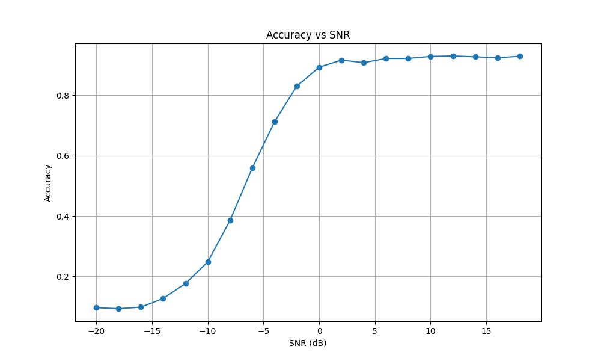

# 自动调制识别（Automatic Modulation Recognition, AMR）

## 简介
本项目开源了一个完整的自动调制识别系统，包括训练与测试全流程。代码基于 **PyTorch** 实现，结构清晰、模块分明，只需按照以下步骤，即可轻松完成训练并获得测试结果。

## 使用步骤

1. **准备数据集**
   - 下载原始数据集 `RML2016.10a_dict.pkl`，并将其放入 `Dataset/` 文件夹下。

2. **划分数据集**
   - 运行 `Dataset/Data_Split.py` 脚本以完成数据预处理和划分。
   - 本脚本将原始数据划分为：
     - `test_data.pkl`：占比 20%，仅用于模型最终测试。
     - `train_val_data.pkl`：占比 80%，用于训练和验证阶段。
   - 这样划分可以有效避免测试集泄露，提高评估可信度。

3. **定义模型结构**
   - 在 `model.py` 中定义你自己的模型结构。
   - 注意保持接口兼容，例如模型应接受形状为 `(batch_size, 2, 128)` 的输入。

4. **开始训练模型**
   - 运行 `train.py` 启动训练过程。
   - 程序将自动加载 `train_val_data.pkl` 和你的模型，开始训练，并将：
     - 最优模型权重保存至 `result/best_model.pth`
     - 训练日志和中间指标保存至 `result/train_results.json`

5. **模型评估**
   - 运行 `test.py`，使用测试集 `test_data.pkl` 对模型进行最终评估。
   - 脚本将加载训练阶段保存的最优模型，并输出：
     - 总体准确率（Overall Accuracy）
     - 不同 SNR 条件下的准确率（SNR-wise Accuracy）
     - 总体混淆矩阵
     - 每个 SNR 的混淆矩阵
     - 所有结果保存在 `result/` 目录下，以 `.json` 和 `.png` 形式输出

---

## 模型示例

以下是一个我设计的简单模型，已包含在 `model.py` 中：

---

## 示例结果

以下是该模型在测试集上评估得到的结果之一：SNR-准确率曲线图（Accuracy vs SNR）。

完整结果文件均保存在 `result/` 文件夹中，包括混淆矩阵图、准确率曲线等。

---

## 总结

是的，就是这么简单！

只要跟着上述步骤一步一步操作，相信你一次就能跑通整个流程。模型训练、测试、评估、可视化全都有，祝你顺利完成自动调制识别任务，加油，兄弟！

---

